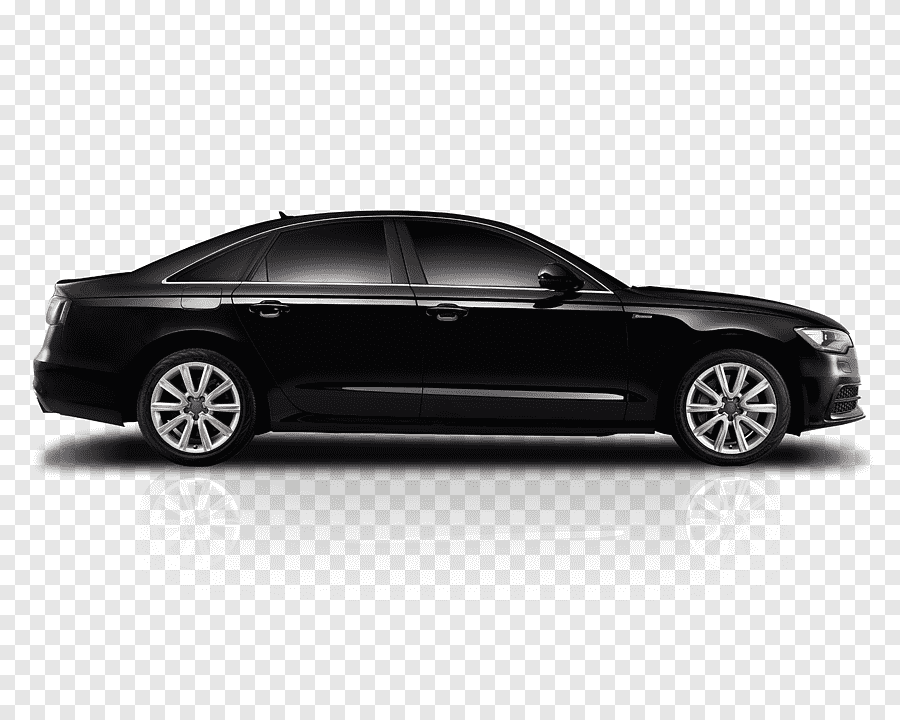

# [UBER]-Partner BusinessModel

# Problem Statement : 
# Scenario 1: It is going to be a huge Saturday and there will need to be many more cars on the road than last week. In order to get drivers to go online, we're assessing the following two bonus options in terms of cost:

Option 1: $50 for each driver that is online at least 8 hours, accepts 90% of requests, completes 10 trips, and has a rating of 4.7 or better during the time frame;
Option 2: $4/trip for all drivers who complete 12 trips, and have a 4.7 or better rating.
Using the dataset provided and given Scenario 1, provide answers to the questions below:

## How much would the total bonus payout be with Option 1?
## How much would the total bonus payout be with Option 2?
## How many drivers would qualify for a bonus under Option 1 but not under Option 2?
## What percentages of drivers online completed less than 10 trips, had an acceptance rate of less than 90%, and had a rating of 4.7 or higher?

# Scenario 2: A taxi driver currently generates $200 per day in fares (before expenses), works six days a week, takes three weeks off, and has the following expenses:

Gas - $200 per week
Insurance - $400 per month
Vehicle rent (by the week) - $500
The driver doesn't pay gas and rent expenses on off weeks.

Now, let's assume that the same driver would buy a Town Car and partner with Uber. If he does, his gas expenses would go up by 5%, his insurance expense would decrease by 20%, and he would no longer be renting a vehicle. However, he would need to buy a car. The driver would still take three weeks off per year.

Given Scenario 2, provide answers to the questions below:

## How much money (after expenses) does the taxi driver make per year without partnering with Uber?
You are convincing the same driver above to buy a Town Car and partner with Uber. Assuming the new car is 40.000 USD, how much would the driver's gross fares need to increase per week to fully pay for the car in year 1 and maintain the same yearly profit margin as before.
